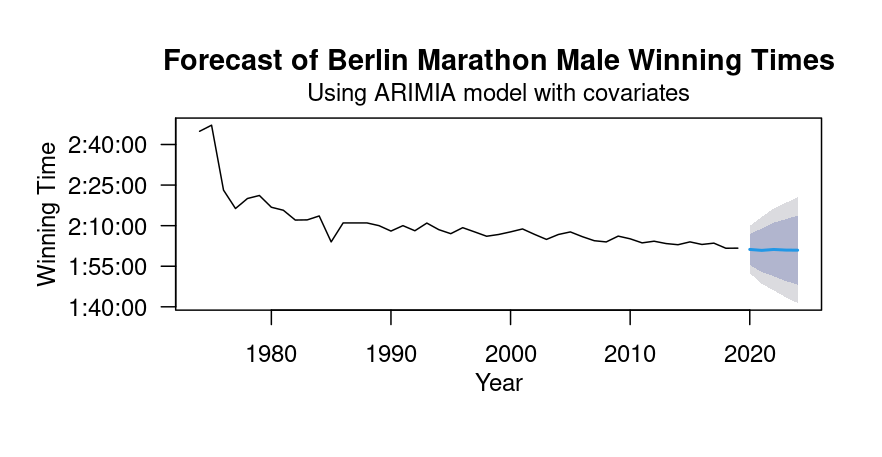

A Time Series Analysis of Winning Berlin Marathon Times
=====================================================
By Thomas Joyce  

Description
=====================================================
Have you ever thought about how thrilling (or painful) it is to run 26.2 miles? For the past half-century, thousands of hobby joggers and professional athletes have flocked to Berlin, Germany to test their limits at the Berlin Marathon. Publicly available on Kaggle, the [Berlin Marathon dataset](https://www.kaggle.com/datasets/aiaiaidavid/berlin-marathons-data) contains finishing times and weather data from 1974 to 2019. Here, I did some descriptive analyses of the Berlin Marathon dataset and also created an ARIMA time series model to forecast future winning times. 

Using This Repository
=====================================================
To use this repository, you will need to access [Docker](https://www.docker.com/).

Build the docker image by typing:
```
docker build . -t 611-project
```

Then start an RStudio server by typing:
```
docker run -d -e PASSWORD=<your-password> --rm -p 8787:8787 -v "$(pwd):/home/rstudio/project" -t 611
```

Once the Rstudio server is running connect to it by visiting
https://localhost:8787 in your browser. 

To build the final report, visit the terminal in RStudio and type

```
make report.pdf
```

Project State
====================================================
This project is still ongoing, but it will be completed soon. 


