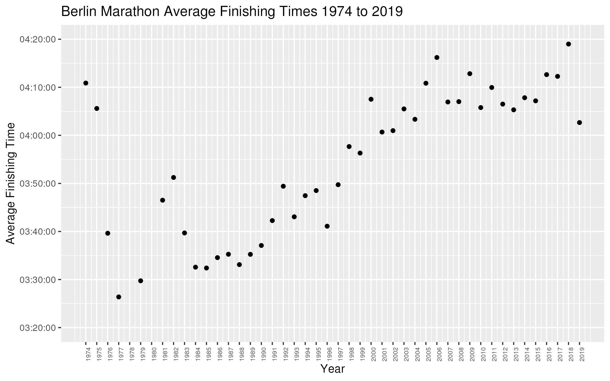
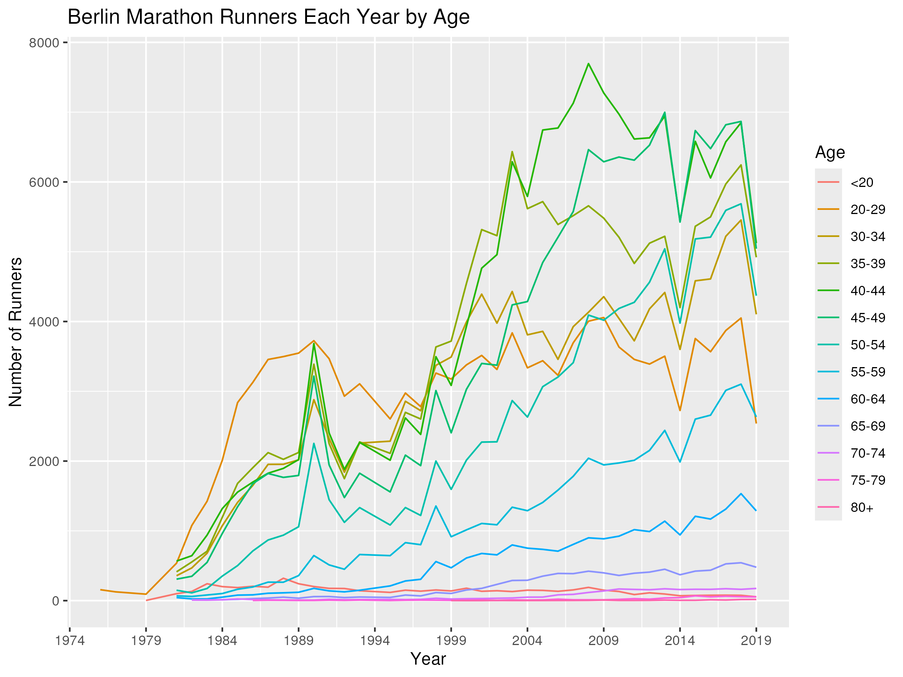
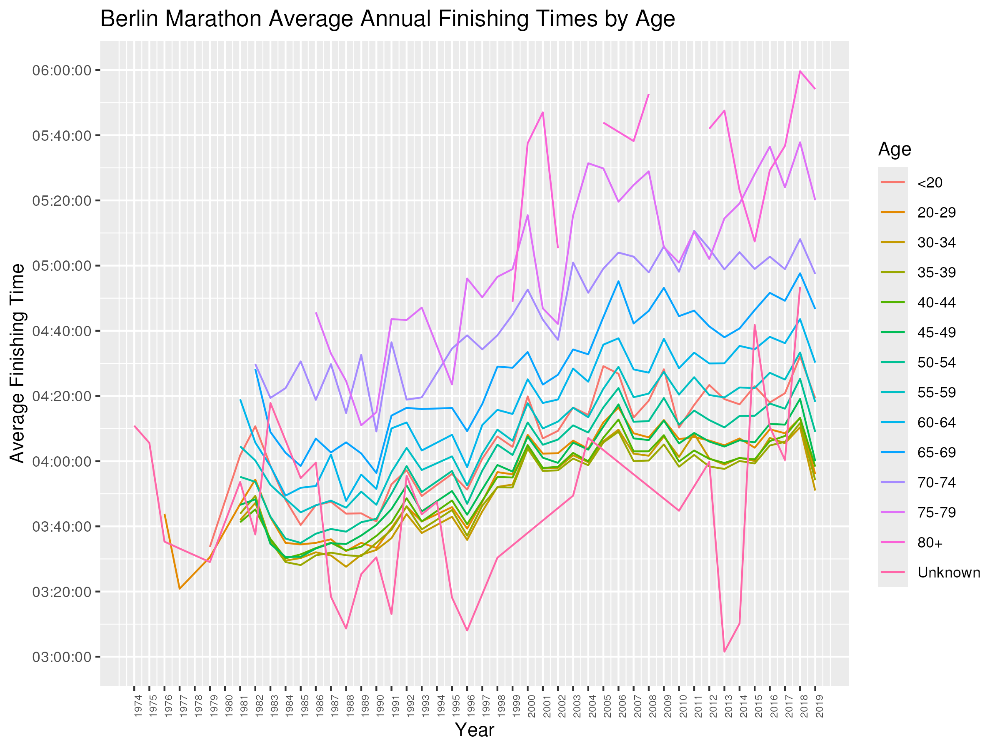
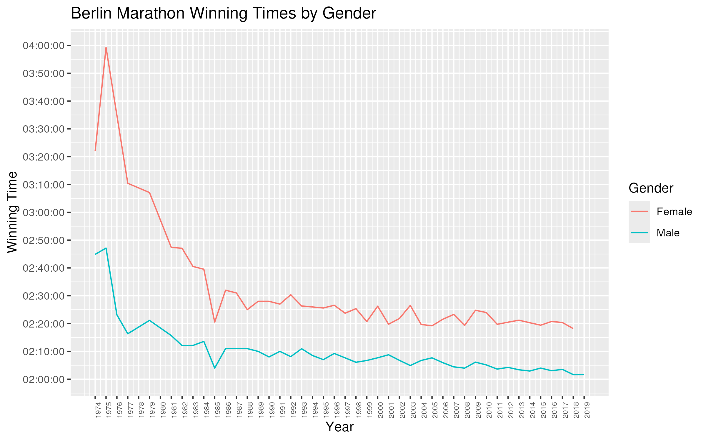
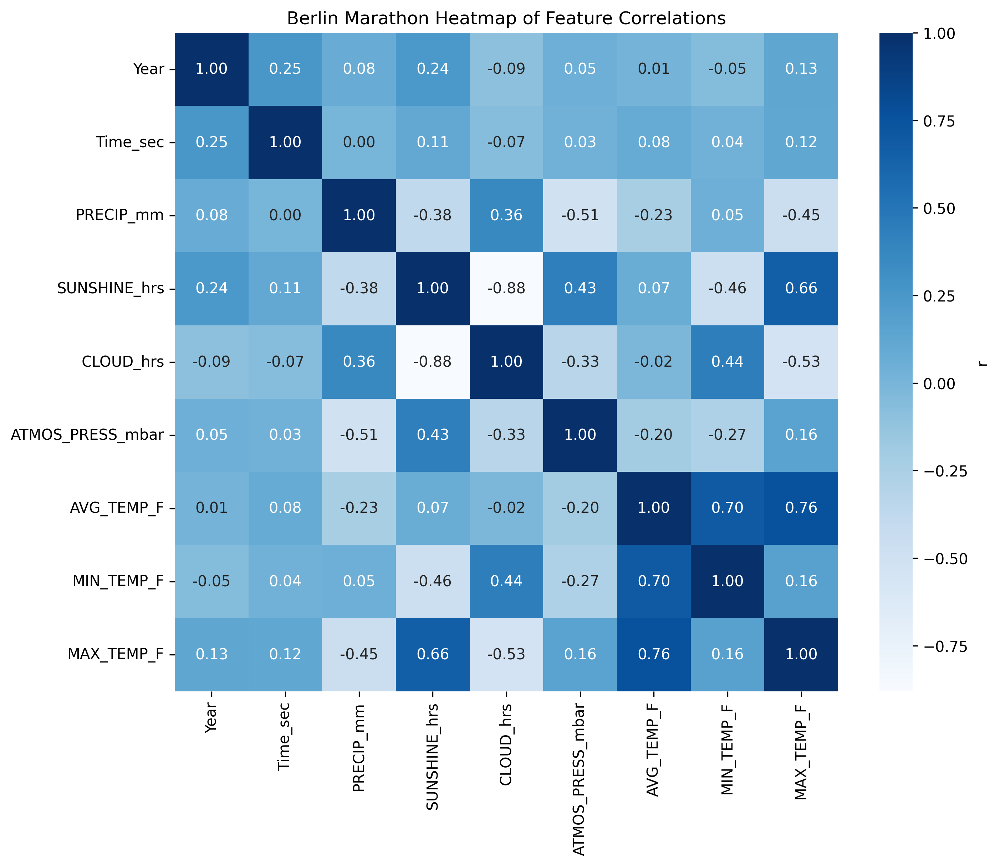
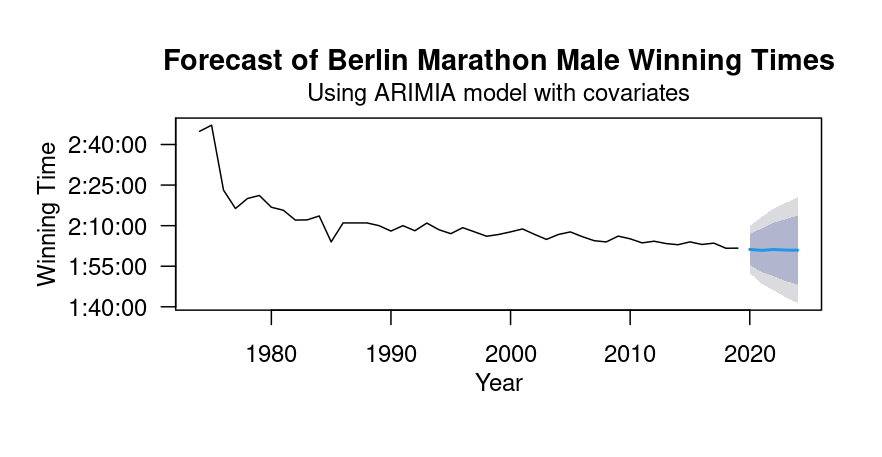

## Introduction

Thousands of athletes from around the world conquer a relatively flat yet still challenging 26.2 miles at the Berlin Marathon in late September every year. This race is considered one of the seven Abbott World Marathon Majors, along with Tokyo, Boston, London, Sydney, Berlin, Chicago, and New York. As one might expect, the Berlin Marathon not only has a highly competitive professional field, but also a rapidly expanding amateur crowd.

Published publicly on Kaggle, the Berlin Marathon dataset contains finishing times and weather conditions for over 800,000 runners between 1974 and 2019. Demographic variables in the Berlin Marathon dataset include age and gender. Weather variables encompass precipitation, hours of sunshine, hours of clouds, atmospheric pressure, average temperature, minimum temperature, and maximum temperature. 

While numerous studies have used the Berlin Marathon dataset to investigate the impact of weather conditions on past running performance (Knechtle et al., 2021; Scheer et al., 2021; Weiss et al., 2024), I was particularly interested in using using demographic and weather features to predict future finishing times. After performing an exploratory data analysis, of the data, I created ARIMA time series models to forecast the winning male and female times from 2021 to 2024 and compared the forecasted times to the actual results. The ARIMA models usually predicted the winning times to within 2-3 minutes of the actual value. Adding weather features to the models did not improve the performance.  

## Exploratory Data Analysis

Before conducting time series analysis, it was essential to obtain a general understanding of how Berlin marathon finishing times have changed over the years. I also wanted to determine which features might be useful predictors of finishing time. A variety of data visualizations were constructed to meet these objectives. 

The number of runners in the Berlin Marathon increased substantially between 1974 to 2019, with over 40,000 runners in 2018 (Figure 1). This is likely due to the increasing popularity in marathons among the general population over the past half century, which coincides with progressive trends in health and fitness. 


While there has been a steady increase in the number of runners at the Berlin Marathon, average times have slowed (Figure 2). In the late 1980's, the average finishing time at the Berlin Marathon was around 3 hours and 35 minutes. However, the average finishing time was close to 4 hours and 10 minutes in the 2010's. It seems reasonable to hypothesize that the increase in runners stems from the fact that more "ordinary" people (i.e., not lifelong runners or professional athletes) are deciding to run marathons, whether that be to improve their cardiovascular health or raise money for charity. If this is the case, it makes sense that average times have slowed because new runners probably aren't too speedy over 26.2 miles. 




Another potential reason for the trend in slower average finishing times is that the proportion of middle aged runners relative to younger runners in the Berlin Marathon has increased over the years (Figure 3). We can see that the 20-29 year old age group had the highest proportion of runners in the 1980's, but towards the 2000's, the proportions of runners aged 40-64 increased substantially. 



Figure 4 shows the average Berlin Marathon finishing times by age between 1974 and 2019. We can see that older age groups generally have slower average finishing times compared to younger age groups. Hence, more older runners entering the race relative to younger runners would make the overall average finishing time slower. 



Figure 5 shows the distributions of marathon times by gender aggregated across all years. We can see that there have been a lot more male finishers of the Berlin Marathon than female finishers. Both time distributions are bell-shaped and can be approximated by a normal kernel. 


Figure 6 shows the winning Berlin Marathon times by gender between 1974 and 2019. Unlike the average finishing times, the winning times have become faster over the years. There was a significant improvement in winning times for both males and females in the early 1980's, and since then winning times have continued to improve in a gradual manner. I am particularly interested in using the Berlin Marathon dataset to predict the winning male and female times in 2021 to 2024 (there was no race in 2020 due to Covid). 



The Berlin Marathon dataset also has data for the weather conditions on the day of the race each year. Figure 7 shows the precipitation trends. Most years had little to no rain on the day of the race. However, 2010 was an outlier with about 30 mm of rain. 


Figure 8 shows the average, minimum, and maximum temperatures on the day of the Berlin Marathon each year. We can see that the average race day temperatures are usually between 50-60 degrees fahrenheit, which is quite tolerable for most runners. In recent years, the maximum temperatures have exceeded 70 degrees, which is a bit hot. Since the race usually begins around 9 or 10 am in the morning, faster runners may not experience the maximum temperatures until near the end of the race. However, runners who took over 4 hours to finish definitely had to deal with the heat in some years. 


To obtain a better understanding of how the weather and time variables in the Berlin Marathon dataset relate to one another, I created a heatmap of feature correlations (Figure 9). The correlations among weather variables are mostly what we would expect. For example, cloud hours and sunshine hours has a strong negative correlation of -0.88, while maximum temperature and sunshine hours has a moderate positive correlation of 0.66. However, most of the weather variables have weak to no correlation with finishing time (in seconds). There is a slight positive correlation between finishing time (in seconds) and year of 0.25. This makes sense because the average times have slowed over the years. 



## Time Series Analysis for Forecasting Winning Times

After exploring finishing time and weather trends in the Berlin Marathon dataset, I wanted to develop a model to predict future male and female winning times using past winning times and a subset weather covariates. Time series was a natural approach to this problem since the winning Berlin Marathon times and weather data have been recorded from 1974 to 2019 in the dataset. I decided to use the Auto-Regressive Integrated Moving Average (ARIMA) time series method from the forecast package in R due to its flexibility in model selection and potential to incorporate external regressors (Hyndman et al., 2024). ARIMA(p,d,q) includes p autoregressors to forecast future values using a linear combination of previously observed values, d differencing components to make the time series stationary, and q moving average components that leverage past errors to forecast future values. I used the auto.arima function in the forecast package to automatically select the values of p, d and q that give the best model on the training data. A random seed value was set to make the results reproducible. 

I created four total ARIMA models to forecast winning Berlin Marathon times for the next five years based on the previous winning times from 1974 to 2019. However, I was only able to compare the model predictions to the actual results for four years (2021 to 2024) since the Berlin Marathon was cancelled in 2020 due to COVID. The first model used previous male winning times to forecast winning male times for the next five years. The second model used previous male winning times and additional covariates to forecast winning male times for the next five years. The third model used previous previous female winning times to forecast female winning times for the next five years. The fourth model used previous male winning times AND additional covariates to forecast female winning times for the next five years. The following weather features were included as covariates in the second and fourth models: precipitation (mm), hours of sunshine, hours of clouds, and maximum temperature (Fahrenheit). Since the ARIMA model is scale invariant, the covariates were not standardized or normalized. 

The first time series model forecasted male winning times without using any weather covariates (Figure 10). This was an ARIMA(0,1,0) model, so the next value in the series only depended on the previous value plus a random error term. We can see that the forecasted winning times for the next five years were all 02:41:41 (Table 1). Despite its lack of variation, this model was actually pretty close to the true winning times, with a mean absolute error of just 1 minute, 48 seconds. 


```{r, echo=FALSE}
readRDS(file = "tables/male_ts_table.rds")
```

The second model forecasted male winning times using weather covariates (Figure 11). This was also an ARIMA(0,1,0) model, but the weather variables were included as additional additive terms. We can see that the forecasted times had some variance when weather covariates were included (Table 2). Overall, the second model's performance was acceptable, but slightly worse than the male winning time model without covariates. 



```{r, echo=FALSE}
readRDS(file = "tables/male_ts_covariates_table.rds")
```

The third model forecasted female winning times without using any weather covariates (Figure 12). This was an ARIMA(2,1,2) model, meaning that it had 2 autoregressors, 1 differencing component, and 2 moving average components. For this model, the forecasted values for the next five years were all between 2 hours, 17 minutes and 2 hours, 19 minutes (Table 3). It turns out that the female winning times had a lot more variation than the male winning times between 2021 and 2024, and the model did not do a great job capturing that variation. However, the overall performance was not bad, with a mean absolute error of 3 minutes and 8 seconds. 


```{r, echo=FALSE}
readRDS(file = "tables/female_ts_table.rds")
```

The fourth model forecasted female winning times using weather covariates (Figure 13). This was an ARIMA(0,1,0) model. With a mean absolute error of 3 minutes, 22 seconds, the fourth model's performance was very similar to the third model's performance. 


```{r, echo=FALSE}
readRDS(file = "tables/female_ts_covariates_table.rds")
```
## Conclusions

This project sought to explore finishing times and weather trends in the Berlin Marathon dataset and use time series analysis to predict future male and female winning times. After examining the feature correlations, I learned that there really wasn't much of a relationship between the weather variables and finishing times. However, I wanted to incorporate weather features into the time series models to see how they would impact the model's performance. Overall, the forecasted values of the ARIMA models were pretty similar with and without covariates, although the models without covariates had slightly lower mean absolute errors. Overall, the ARIMA models offered smooth forecasts that weren't too far from the truth, but they failed to capture the year-to-year variation in winning times, particularly for female athletes. I'm thinking that a potential way to improve these models is by incorporating covariates related to competition (i.e., which elite athletes are in the race and what their personal best times are) along with contract bonuses and prize money (which could provide an incentive for professionals to run faster times). It would also be interesting to explore other machine learning methods.

## References

Hyndman R, Athanasopoulos G, Bergmeir C, Caceres G, Chhay L,
  O'Hara-Wild M, Petropoulos F, Razbash S, Wang E, Yasmeen F (2024).
  _forecast: Forecasting functions for time series and linear models_. R
  package version 8.23.0, <https://pkg.robjhyndman.com/forecast/>.

Knechtle, B., Valero, D., Villiger, E., Alvero-Cruz, J. R., Nikolaidis, P. T., Cuk, I., ... & Scheer, V. (2021). Trends in weather conditions and performance by age groups over the history of the Berlin Marathon. Frontiers in physiology, 12, 654544.

Scheer, V., Valero, D., Villiger, E., Alvero Cruz, J. R., Rosemann, T., & Knechtle, B. (2021). The optimal ambient conditions for world record and world class performances at the Berlin Marathon. Frontiers in physiology, 12, 654860.

Weiss, K., Valero, D., Villiger, E., Scheer, V., Thuany, M., Aidar, F. J., ... & Knechtle, B. (2024). Associations between environmental factors and running performance: An observational study of the Berlin Marathon. Plos one, 19(10), e0312097.


